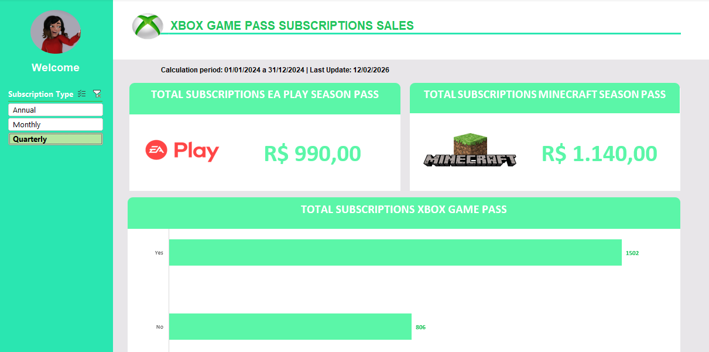

# 🎮 Dashboard de Vendas - Xbox Game Pass

Este repositório contém a entrega do Desafio de Projeto da DIO, focado na criação de Dashboards Estratégicos no Excel.

O objetivo foi transformar uma base de dados bruta de assinaturas fictícias em um painel visual para tomada de decisão, utilizando o **Método ABCDE** para organização e estruturação do projeto.

---

## 🧩 Metodologia Aplicada: O Método ABCDE

Para garantir a escalabilidade e organização do arquivo, o projeto foi dividido em 5 etapas/pastas distintas:

1.  **A - Assets (Recursos):** Centralização de recursos visuais como logotipos, ícones e paleta de cores.
2.  **B - Bases (Dados):** Armazenamento da base de dados bruta (raw data).
3.  **C - Cálculos (Processamento):** "Meio de campo" onde ocorrem os tratamentos, tabelas dinâmicas e cálculos auxiliares.
4.  **D - Dashboard (Visualização):** O painel final interativo destinado ao usuário.
5.  **E - Extras:** Espaço reservado para documentações ou versões anteriores.

---

## 🎨 Identidade Visual (Assets)

A paleta de cores foi definida para respeitar a identidade visual da marca Xbox, garantindo familiaridade e estética profissional.

| Cor | Código Hex | Aplicação |
| :--- | :--- | :--- |
| **Xbox Green** | `#9BC848` | Elementos de destaque |
| **Xbox Dark Green** | `#22C55E` | Detalhes e Bordas |
| **Menu Highlights** | `#2AE6B1` | Botões e Seleções |
| **Bar Chart Standard** | `#5BF6A8` | Cor padrão das barras do gráfico |
| **Negative Zone** | `#E8E6E9` | Fundo e áreas neutras |

---

## 📊 Estrutura de Dados (Bases)

A análise foi realizada sobre uma base de dados fictícia de assinantes, contendo as seguintes colunas:
* `Subscriber ID`, `Name`, `Plan`
* `Start Date`, `Auto Renewal`
* `Subscription Price`, `Subscription Type`
* `EA Play Season Pass`, `EA Play Price`
* `Minecraft Season Pass`, `Minecraft Price`
* `Coupon Value`, `Total Value`

---

## 📈 Perguntas de Negócio & Soluções (Cálculos e Dashboard)

O dashboard foi desenhado para responder a 3 perguntas estratégicas principais:

### 1. Quanto foi faturado com assinaturas anuais?
* **Solução:** Criação de uma Tabela Dinâmica cruzando *Subscription Type* com *Total Value*.
* **Visualização:** Gráfico de Barras formatado na cor `#5BF6A8` para melhor legibilidade (Data View).

### 2. Qual o total de vendas do "EA Play Season Pass"?
* **Regra de Negócio:** Vendas atreladas majoritariamente ao plano Ultimate.
* **Solução:** Utilização do conceito de **Big Number** (Cartão de KPI).
* **Técnica:** O valor é exibido em um card isolado para destacar a magnitude do número, sem a necessidade de um gráfico complexo.

### 3. Qual o total de vendas do "Minecraft Season Pass"?
* **Solução:** Aplicação do mesmo conceito de **Big Number** utilizado para o EA Play, mantendo a consistência visual.

---

## ⚙️ Implementação Técnica e UX

Para entregar uma experiência de uso profissional e guiada:

* **Segmentação de Dados (Slicers):** Implementamos filtros interativos que controlam tanto o Gráfico de Barras quanto os Cards (Big Numbers) simultaneamente. Isso foi feito através da "Conexão de Relatórios" nas tabelas dinâmicas.
* **Padronização de Idioma:** Toda a interface e dados foram padronizados em Inglês para manter a coerência com a marca global.
* **Proteção e Limpeza:**
    * A planilha foi **protegida**, deixando apenas a Segmentação de Dados desbloqueada para interação.
    * Abas de planilhas (Cálculos, Bases, Assets) foram ocultas.
    * Linhas de grade, títulos e barras de fórmulas foram removidos para criar uma experiência "App-like" (sem cara de Excel).

## 🖼️ Resultado Final

---
**Desenvolvido por [Philipe Daryl]**
